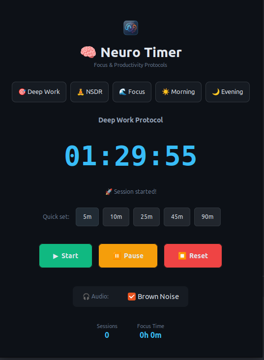

<div align="center">

# 🧠 Neuro Timer

**A productivity timer with focus protocols — Desktop & Web**

_Optimize your work sessions with science-based timing techniques_

[](https://python.org)
[](https://gtk.org)
[](web/)
[](LICENSE)
[](https://ubuntu.com)

**[🌐 Try Web Version](https://metaphysicist1.github.io/neuro-timer/)** · **[📦 Download AppImage](https://github.com/Metaphysicist1/neuro-timer/releases)**



</div>

---

## 🎯 Overview

Neuro Timer is a productivity application available as both a **GTK3 desktop app for Linux** and a **Progressive Web App (PWA)** for any browser. It helps you optimize your work sessions using proven productivity protocols including deep work timers, NSDR (Non-Sleep Deep Rest) with ambient audio, and brown noise for focus.

### Key Features

- **🎯 90-Minute Deep Work** — Optimal session length for sustained focus
- **🧘 NSDR Mode** — 10-minute rest sessions with relaxation audio
- **🌊 Brown Noise** — Background audio for enhanced concentration
- **☀️ Morning Protocol** — Start your day with intention
- **🌙 Evening Wind-Down** — Transition out of work mode
- **📊 Session Tracking** — Monitor daily focus time
- **🔔 Desktop Notifications** — Native Ubuntu/GNOME integration
- **🌐 Web Version** — Works on any device with a browser

---

## 🚀 Quick Start

### 🌐 Web Version (Instant)

No installation needed — works on any device:

**[→ Open Web App](https://metaphysicist1.github.io/neuro-timer/)**

Features:
- All 5 protocols with quick presets
- Brown noise generator (Web Audio API)
- NSDR video integration
- Session tracking
- PWA — installable on mobile/desktop

### 🐧 Linux Desktop App

```bash
# Clone the repository
git clone https://github.com/metaphysicist1/neuro-timer.git
cd neuro-timer

# Run the installer
./install.sh

# Or run directly
python3 neuro_timer.py
```

### Pin to Dock

1. Press **Super** key
2. Search "**Neuro Timer**"
3. Right-click → **Add to Favorites**

---

## 🎵 Audio Features

| Feature     | File               | Description                |
| ----------- | ------------------ | -------------------------- |
| NSDR Music  | `assets/nsdr.mp3`  | Plays during NSDR sessions |
| Brown Noise | `assets/brown.mp3` | Toggle anytime for focus   |

**Requires:** `mpv` audio player

```bash
sudo apt install mpv
```

> ⚠️ **Audio files are NOT included** in this repository due to licensing.
> Add your own royalty-free audio to `assets/`. See [Audio Setup](#-audio-setup) below.

---

## 🔊 Audio Setup

Audio files must be added manually. Recommended free sources:

| Source      | License          | Link                                           |
| ----------- | ---------------- | ---------------------------------------------- |
| Freesound   | Creative Commons | [freesound.org](https://freesound.org)         |
| Pixabay     | Royalty-free     | [pixabay.com/music](https://pixabay.com/music) |
| Incompetech | CC BY            | [incompetech.com](https://incompetech.com)     |

**Setup:**

```bash
# Add your audio files
cp your_relaxation.mp3 assets/nsdr.mp3
cp your_brown_noise.mp3 assets/brown.mp3
```

---

## 📋 Protocols

| Protocol    | Duration | Purpose                            |
| ----------- | -------- | ---------------------------------- |
| Deep Work   | 90 min   | Extended focused work session      |
| NSDR        | 10 min   | Mental reset with relaxation audio |
| Focus Reset | 1 min    | Quick attention recalibration      |
| Morning     | 10 min   | Intentional day start              |
| Evening     | 15 min   | Work-to-rest transition            |

---

## 🛠️ Technical Stack

| Component     | Desktop (GTK)             | Web (PWA)                |
| ------------- | ------------------------- | ------------------------ |
| Language      | Python 3.6+               | Vanilla JavaScript       |
| GUI Framework | GTK3 (PyGObject)          | HTML5 / CSS3             |
| Threading     | Python `threading` module | Web Workers              |
| Audio         | mpv / ffplay / vlc        | Web Audio API            |
| Notifications | libnotify                 | Notification API         |

### Project Structure

```
neuro-timer/
├── neuro_timer.py      # Desktop application (GTK3)
├── web/                # Web application (PWA)
│   ├── index.html      # Single-page app
│   ├── manifest.json   # PWA manifest
│   ├── sw.js           # Service worker
│   └── icon-*.png      # App icons
├── assets/
│   ├── icon.png        # App icon
│   ├── nsdr.mp3        # NSDR audio (add your own)
│   └── brown.mp3       # Brown noise (add your own)
├── install.sh          # Desktop integration
├── neuro-timer.desktop # Launcher file
├── .gitignore          # Excludes audio files
├── README.md
└── LICENSE
```

---

## 📋 Requirements

- **Python 3.6+**
- **GTK3** (pre-installed on Ubuntu/GNOME)
- **mpv** (for audio playback)

```bash
# Install dependencies
sudo apt install python3-gi python3-gi-cairo gir1.2-gtk-3.0 mpv
```

---

## 🎨 Customization

### Replace Audio Files

Simply replace the files in `assets/`:

- `nsdr.mp3` — Your preferred relaxation audio
- `brown.mp3` — Your preferred background noise

### Modify Protocols

Edit the `protocols` list in `neuro_timer.py`:

```python
protocols = [
    ("🎯 Deep Work", "deep_work", 90),
    ("🧘 NSDR", "nsdr", 10),
    # Add custom protocols:
    ("🍅 Pomodoro", "pomodoro", 25),
]
```

---

## 🤝 Contributing

Contributions welcome! Ideas:

- [ ] Binaural beat generation
- [ ] Session history export
- [ ] Custom protocol builder
- [ ] Keyboard shortcuts
- [ ] System tray integration
- [ ] Mobile app (React Native)
- [ ] Sync across devices

---

## 📄 License

MIT License — see [LICENSE](LICENSE) for details.

> **Note:** Audio files in `assets/` are excluded from the MIT license and are
> for personal use only. See LICENSE file for full disclaimer.

---

## 👨‍💻 Author

**Edgar Abasov**

- GitHub: [@Metaphysicist1](https://github.com/Metaphysicist1)
- LinkedIn: [Edgar Abasov](https://www.linkedin.com/in/edgar-abasov/)

---

<div align="center">

_Built with ❤️ for focused work_

**⭐ Star this repo if you find it useful!**

| Desktop | Web |
|---------|-----|
|  |  |

</div>
